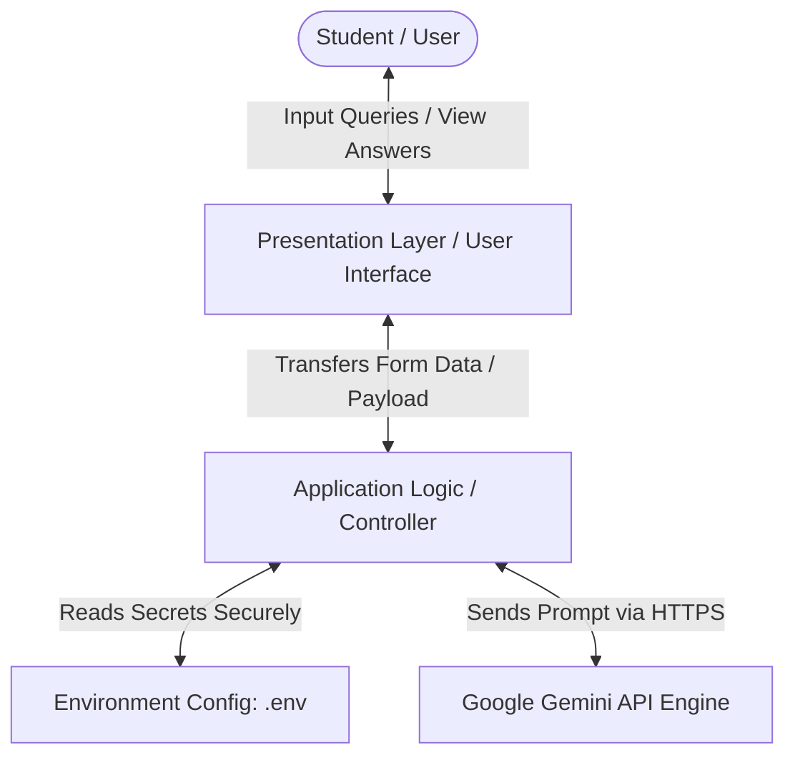
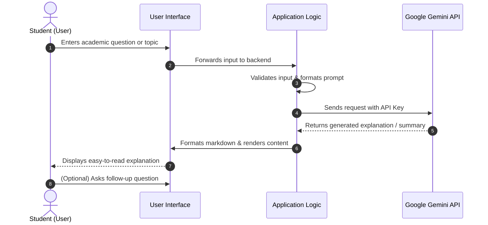

# EduGenie: Google Gemini Powered Learning Assistant

[](https://ai.google.dev/)
[]()
[](https://opensource.org/licenses/MIT)

---

## 1. Project Title
**EduGenie: Google Gemini Powered Learning Assistant**  
An intelligent, interactive, AI-driven educational companion designed for modern learners.

---

## 2. Project Overview
**EduGenie** is an AI-powered learning assistant that leverages the Google Gemini Large Language Model (LLM) to assist students in learning, understanding, revising, and interacting with academic content. 

Traditional education often leaves students struggling with difficult textbooks, inaccessible tutors outside classroom hours, and broad, uncurated web search results. EduGenie addresses these issues by offering an accessible, conversational interface where students can ask academic questions, receive simplified explanations for complex concepts, generate concise revision summaries, and receive interactive learning support at their own pace.

---

## 3. Abstract
The rapid evolution of generative Artificial Intelligence provides transformative opportunities for academic pedagogy and self-directed learning. **EduGenie** is conceived as a dedicated academic assistant powered by Google Gemini to facilitate self-paced learning for students.

The primary objective of EduGenie is to bridge the gap between classroom teaching and independent study. By integrating Google's state-of-the-art Gemini API, the system interprets student queries, provides step-by-step conceptual breakdowns, and delivers structured academic summaries. EduGenie minimizes study fatigue, promotes active recall, and ensures high availability of academic guidance without expensive tutoring services. This report and documentation outline the system requirements, architectural framework, core modules, operational workflow, and implementation safeguards of the EduGenie project.

---

## 4. Problem Statement
Students across various educational streams face common academic obstacles:
1. **Complex Academic Language:** Textbooks and research papers often employ dense, abstract academic terminology that is difficult for beginners to grasp.
2. **Limited Tutor Availability:** Personalized academic support is frequently unavailable outside school/college hours, leaving doubts unaddressed before examinations.
3. **Information Overload:** Conventional web searches yield millions of disorganized links, blogs, and advertisements rather than direct, structured educational answers.
4. **Time-Consuming Revision:** Manually summarizing lengthy chapters and lecture notes consumes extensive study time that could otherwise be spent understanding fundamental concepts.
5. **Passive Learning:** Reading static textbooks lacks the dynamic inquiry and active questioning necessary for deep comprehension.

EduGenie is designed to directly solve these challenges by functioning as a 24/7 interactive academic mentor.

---

## 5. Objectives
The core objectives of the EduGenie project are:
* **Deliver Accurate Academic Answers:** Provide intelligent, context-aware answers to student queries across various subjects.
* **Simplify Complex Concepts:** Break down intricate theories, formulas, and concepts into intuitive, easy-to-understand explanations.
* **Enable Rapid Revision:** Automatically produce clear, condensed chapter and topic summaries for efficient exam preparation.
* **Provide Interactive Study Support:** Offer a conversational question-answering environment that encourages active inquiry.
* **Ensure User-Friendly Access:** Deliver a clean, responsive, and student-focused interface requiring no advanced technical skills to operate.
* **Maintain High Security & Compliance:** Protect API credentials and user data through secure environment configuration practices.

---

## 6. Proposed Solution
EduGenie proposes a centralized, AI-powered learning workspace:
* **Generative AI Core:** Connects directly to the Google Gemini API to harness advanced natural language reasoning, contextual comprehension, and educational content generation.
* **Pedagogical Prompt Structuring:** Formulates student inputs into educational contexts, directing Gemini to respond with clear formatting (headings, bullet points, key takeaways, and illustrative examples).
* **Instant Doubt Resolution:** Allows students to ask follow-up questions until they achieve complete clarity on a topic.
* **Accessible Architecture:** Built with lightweight, modular components for easy deployment on student computers and educational institutions.

---

## 7. Key Features
| Feature | Description |
| :--- | :--- |
| **Intelligent Academic Q&A** | Generates accurate, relevant answers tailored to curriculum-related queries. |
| **Simple Concept Explanations** | Translates complex academic jargon into beginner-friendly explanations with analogies. |
| **Content Summarization** | Condenses long academic passages, topics, or notes into bulleted summaries. |
| **Interactive Learning Support** | Supports iterative questioning and conversational follow-ups for revision. |
| **User-Friendly Interface** | Simple, uncluttered interface designed for quick navigation and reading comfort. |
| **Additional Custom Features** | `[To be added - Specify any additional features such as PDF input, Quiz Generator, or Note-Export if implemented]` |

---

## 8. Technologies Used
> **Note:** The underlying system utilizes the Google Gemini API. Specific runtime frameworks, libraries, and tools can be adapted to your project's chosen tech stack.

* **Core AI Engine:** Google Gemini API (`gemini-1.5-flash` / `gemini-1.5-pro` or equivalent)
* **Programming Language:** `[To be added - e.g., Python 3.x / JavaScript / TypeScript]`
* **Frontend / UI Framework:** `[To be added - e.g., Streamlit / Flask with HTML5, CSS3, JavaScript / React]`
* **Backend Framework / Controller:** `[To be added - e.g., Python / Node.js / Flask / FastAPI]`
* **API Client / SDK:** `[To be added - e.g., google-generativeai / @google/genai / Axios / Fetch]`
* **Configuration & Environment:** `python-dotenv` / `.env` for API key protection
* **Version Control:** Git & GitHub

---

## 9. System Requirements

### Hardware Requirements
* **Processor:** Intel Core i3 (6th Gen or above) / AMD Ryzen 3 or equivalent
* **RAM:** Minimum 4 GB (8 GB recommended for smooth multi-tasking)
* **Storage:** 500 MB free hard drive space (for source code and environment dependencies)
* **Network:** Stable broadband/Wi-Fi internet connection (mandatory for communicating with Google Gemini API servers)

### Software Requirements
* **Operating System:** Windows 10/11, macOS, or Linux (Ubuntu 20.04+)
* **Runtime Environment:** `[To be added - e.g., Python 3.9+ or Node.js v18+]`
* **Modern Web Browser:** Google Chrome, Microsoft Edge, Mozilla Firefox, or Brave
* **Code Editor (Optional):** Visual Studio Code / PyCharm

---

## 10. System Architecture

EduGenie follows a multi-tier client-server architecture separating the User Interface, Application Logic, and Cloud AI Services.

### Text-Based Architecture Diagram
```text
+-------------------------------------------------------------+
|                        STUDENT / USER                       |
+-------------------------------------------------------------+
                               |
                               | (Interacts via Web Browser)
                               v
+-------------------------------------------------------------+
|                PRESENTATION LAYER (Frontend)                |
|  - Student Query Input Box                                  |
|  - Explanation & Summary Display Screen                     |
|  - Formatting Engine (Markdown, LaTeX Math, Bullet Points)  |
+-------------------------------------------------------------+
                               |
                               | (HTTP / REST / WebSocket)
                               v
+-------------------------------------------------------------+
|             APPLICATION LOGIC LAYER (Backend)               |
|  - Request Validator & Sanitizer                            |
|  - Prompt Engineering & Context Preparer                    |
|  - Environment & API Key Manager (.env)                     |
|  - Error & Exception Handler                                |
+-------------------------------------------------------------+
                               |
                               | (Secure HTTPS Request with API Key)
                               v
+-------------------------------------------------------------+
|               AI SERVICE LAYER (Google Cloud)               |
|                    Google Gemini API                        |
|  - Large Language Model Inference                           |
|  - Natural Language Understanding & Generation              |
+-------------------------------------------------------------+
```

### Architecture Flow (Mermaid)


---

## 11. System Workflow

The end-to-end execution flow of EduGenie is outlined below:

### Workflow Diagram (Mermaid)


### Workflow Steps
1. **Input Submission:** The student enters an academic doubt, topic name, or study passage into the EduGenie input field.
2. **Context Enrichment:** The backend prepares the user query with academic instructions (e.g., "Explain clearly for a student with examples and summaries").
3. **API Dispatch:** The system securely passes the structured request to the Google Gemini endpoint using HTTPS.
4. **Model Inference:** Google Gemini processes the text, performs semantic reasoning, and synthesizes an educational explanation.
5. **Response Delivery:** The backend captures Gemini's response, verifies its integrity, formats it into structured Markdown, and displays it to the student.

---

## 12. Modules of the System

1. **User Interface (UI) Module:**
   * Collects questions, topics, or passages from students.
   * Renders AI responses with clear headings, bullet points, and code/math blocks.
   * Provides quick action buttons (Ask, Summarize, Explain, Clear).

2. **Prompt Processing & Dispatch Module:**
   * Sanitizes input to avoid empty or invalid queries.
   * Wraps academic questions in pedagogical instructions to ensure educational tone and clarity.

3. **Google Gemini API Integration Module:**
   * Loads the API credentials safely from `.env`.
   * Establishes an HTTPS connection to the Gemini endpoint.
   * Manages API timeouts, token limits, and network errors gracefully.

4. **Response Formatting & Display Module:**
   * Parses the raw text returned by the model.
   * Formats output using standard Markdown for maximum readability.

5. **Additional Modules:**
   * `[To be added - e.g., File Upload Module, Flashcard Module, User History Module if implemented]`

---

## 13. Working of the Application

* **Step 1: Application Launch:** The student launches the application locally or through a web URL.
* **Step 2: Selecting an Activity:** The student chooses what they need assistance with:
  * *Ask a Question:* Query a specific concept (e.g., "What is polymorphism in Object-Oriented Programming?").
  * *Explain Simply:* Request an analogy-driven breakdown (e.g., "Explain binary search like I'm 12 years old").
  * *Summarize Content:* Paste a chapter excerpt or notes to get key takeaways.
* **Step 3: Processing & Querying Gemini:** EduGenie sends the request to Google Gemini with instructions to maintain an encouraging, academic tone.
* **Step 4: Reviewing Results:** The student reads the structured response, takes notes, or enters a follow-up query to deepen their understanding.

---

## 14. Google Gemini API Integration

EduGenie connects to the Google Gemini API to leverage Google's multimodal, high-efficiency language models.

### Integration Mechanism
* **Endpoint / SDK:** Uses Google AI Studio's Generative Language API.
* **Authentication:** Carried out using an API Key passed in the request header or initialized through Google's official client SDK.
* **Prompt Engineering Strategy:** The system injects contextual instructions ensuring that responses remain accurate, concise, student-friendly, and free from unnecessary verbosity.
* **Error Handling:** Implements exception handling for rate limits (HTTP 429), authorization errors (HTTP 403/401), and connection timeouts.

---

## 15. Advantages
* **24/7 Availability:** Provides continuous learning assistance anytime, anywhere.
* **Self-Paced Learning:** Enables students to ask repetitive questions without hesitation until concepts are understood.
* **Clarity & Simplification:** Transforms intimidating theoretical topics into digestible summaries and analogies.
* **Time Efficient:** Significantly cuts down the time required to read and summarize voluminous study materials.
* **Cost-Effective:** Utilizes Gemini's free tier quotas, making it accessible for college students.

---

## 16. Limitations
* **Active Internet Dependency:** Requires an uninterrupted internet connection to contact Google servers; cannot function offline.
* **API Quota Restrictions:** Subject to the rate limits and quotas imposed by the Google Gemini free/developer tier.
* **Possibility of Hallucinations:** Like all Large Language Models, responses must be cross-verified for critical examination facts and syllabus guidelines.
* **Context Constraints:** Processing excessively large textbooks in a single prompt may be bounded by token context limits unless chunking is implemented.

---

## 17. Future Enhancements
* **Document / PDF Upload (RAG):** Enable students to upload specific textbook PDFs or lecture slides to ask questions directly from their prescribed syllabus.
* **Speech-to-Text & Text-to-Speech:** Integrate voice query input and audio explanations for improved accessibility.
* **Interactive Quiz & Flashcard Generator:** Automatically generate multiple-choice questions (MCQs) and flashcards from study topics for active recall testing.
* **Multilingual Translation:** Support explanations in regional languages for non-native English speaking students.
* **Personalized Study Dashboard:** Add user login, bookmarks, and revision history tracking.

---

## 18. Applications
* **Undergraduate & College Studies:** Quick reference for BCA, B.Sc., B.Tech, and diploma students tackling technical concepts.
* **Competitive Exam Preparation:** Rapid revision and formula clarification for entrance and competitive tests.
* **Distance & E-Learning:** Supplementing self-study for students enrolled in open university or remote degree programs.
* **Educator Support:** Assisting teachers in preparing easy-to-understand explanations and chapter summaries for lectures.

---

## 19. Installation and Setup Instructions

Follow these steps to set up and run EduGenie locally on your computer:

### Prerequisites
* `[To be added - e.g., Python 3.9+ or Node.js v18+]` installed on your machine.
* Git installed on your system.
* A Google Gemini API Key from Google AI Studio.

### Step-by-Step Setup

1. **Clone the Repository:**
   ```bash
   git clone https://github.com/[your-username]/[your-repo-name].git
   cd [your-repo-name]
   ```
   *(Replace with your actual GitHub username and repository name)*

2. **Create a Virtual Environment (if Python is used):**
   ```bash
   # On Windows
   python -m venv venv
   venv\Scripts\activate

   # On macOS/Linux
   python3 -m venv venv
   source venv/bin/activate
   ```

3. **Install Dependencies:**
   ```bash
   # If Python-based:
   pip install -r requirements.txt

   # If Node.js-based:
   npm install
   ```
   *(Adjust according to your project's package manager)*

4. **Configure Environment Variables:**
   * Create a `.env` file in the root directory (refer to Section 20).
   * Add your Gemini API key.

5. **Run the Application:**
   ```bash
   # For Streamlit apps:
   streamlit run app.py

   # For Flask apps:
   python app.py

   # For Node.js / React apps:
   npm start
   ```
   *(Use the specific command configured for your project)*

6. **Access EduGenie:**
   * Open your browser and navigate to the address shown in your terminal (typically `http://localhost:8501` or `http://localhost:5000` or `http://localhost:3000`).

---

## 20. Environment Variables and API Key Configuration

### Obtaining a Google Gemini API Key
1. Visit the [Google AI Studio](https://aistudio.google.com/).
2. Log in with your Google account.
3. Click on **"Get API key"** and select **"Create API key in new project"**.
4. Copy the generated API key.

### Creating the `.env` File
In your project root directory, create a file named `.env`:

```env
# Google Gemini API Key Configuration
GEMINI_API_KEY=your_actual_gemini_api_key_here
```

Also provide a `.env.example` file in your repository for collaborators:
```env
# .env.example (Safe to commit)
GEMINI_API_KEY=your_gemini_api_key_here
```

### Critical API Key Protection Instructions
> [!CAUTION]
> **NEVER commit your `.env` file or hardcode your Gemini API key into any public code file.**
> Committing API keys to GitHub can lead to unauthorized usage, quota exhaustion, or account suspension.

1. **Always maintain a `.gitignore` file** containing `.env`:
   ```gitignore
   # Security & Credentials
   .env
   .env.local
   *.key

   # Python / Environment files
   venv/
   __pycache__/
   *.pyc

   # Node files (if applicable)
   node_modules/
   ```

2. **Verify Before Pushing:**
   Before running `git commit` or `git push`, verify that `.env` is not tracked:
   ```bash
   git status
   ```
   If `.env` appears under "Untracked files", ensure your `.gitignore` contains `.env`.

3. **Accidental Exposure Procedure:**
   If you accidentally push your API key to GitHub:
   * Go immediately to [Google AI Studio API Keys](https://aistudio.google.com/app/apikey).
   * Delete or revoke the compromised key.
   * Generate a fresh key and update your local `.env`.
   * Remove the sensitive commit from your Git history.

---

## 21. Project Folder Structure

> **Note:** Customize the filenames below to match your exact project file organization.

```text
EduGenie/
├── assets/
│   ├── images/              # Icons, banners, diagrams
│   └── screenshots/         # Application demo screenshots
│       ├── dashboard.png
│       ├── qa_demo.png
│       └── summary_demo.png
├── [src or app directory]/  # Source code files [To be added based on stack]
│   ├── app.py               # Main application entry point
│   ├── gemini_client.py     # Gemini API integration helper
│   └── utils.py             # Helper utilities and formatting
├── .env                     # Secret API key (Ignored by Git)
├── .env.example             # Template for environment variables
├── .gitignore               # Files and patterns ignored by Git
├── requirements.txt         # Dependencies list (or package.json)
└── README.md                # Project documentation and report
```

---

## 22. Screenshots / Demo Section

> *Place actual screenshots of your EduGenie running application into `assets/screenshots/` and update the paths below.*

### 1. EduGenie Main Interface

*Figure 1: Main landing screen and query input window of EduGenie.*

### 2. Intelligent Q&A and Simplified Explanation

*Figure 2: EduGenie providing structured, simplified answers to a student question.*

### 3. Academic Summarization Demo

*Figure 3: Automatic bullet-point summary generated for rapid exam revision.*

## 23. Conclusion
**EduGenie: Google Gemini Powered Learning Assistant** exemplifies the practical application of modern Generative Artificial Intelligence in undergraduate academia. By tapping into the contextual intelligence of Google Gemini, EduGenie transforms passive academic studying into an active, responsive, and personalized learning experience. 

It tackles key learning hurdles—such as difficult textbook language, after-hours doubt resolution, and tedious revision processes—in a single, unified interface. With further planned enhancements such as syllabus document integration, multilingual explanations, and quiz generation, EduGenie holds strong potential to serve as an indispensable learning companion for students across higher education institutions.
